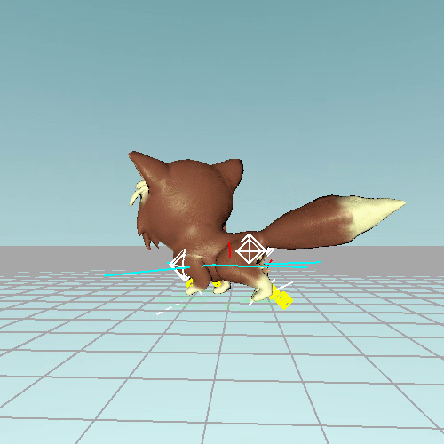

# Ceramic
Procedural animation written in Rust using [Amethyst Engine](https://amethyst.rs/).

[](https://streamable.com/pmh68o)

## Compile and Run
To compile, use the following command:
```shell script
cargo build --features "vulkan"
```
To switch graphics backend to `metal`, type
```shell script
cargo build --features "metal"
```

After compiling, type the following command to run:
```shell script
cargo run
```

## Controls
- `W` `S`: move
- `A` `D`: rotate
- `E` `Q`: speed up/down

## Credits
[The cat model](https://www.turbosquid.com/FullPreview/Index.cfm/ID/1197009) is supplied under [Royalty Free License](https://blog.turbosquid.com/royalty-free-license/).